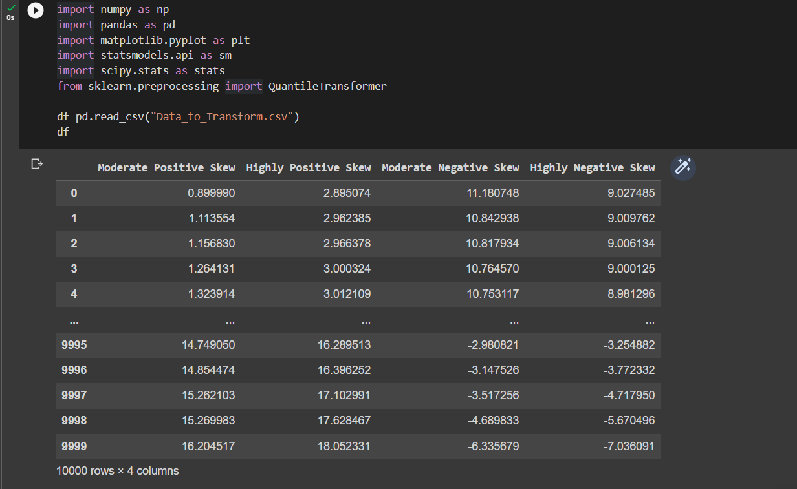

# Ex-06-Feature-Transformation

# Aim:
Read the given data and perform Feature Transformation process and save the data to a file.

# Explanation:
Feature Transformation is a technique by which we can boost our model performance. Feature transformation is a mathematical transformation in which we apply a mathematical formula to a particular column(feature) and transform the values which are useful for our further analysis.

## Algorithm:
# Step1:
Import the necessary modules required.

# Step2:
Read the given data.

# Step3:
Apply Feature Transformation techniques to all the features of the data set.

# Step4:
Get the output of the data set.

# Step5:
End the program.

## Program:
``` python
# Developed by: Shakthi kumar S
# Register number: 212222110043

import numpy as np
import pandas as pd
import matplotlib.pyplot as plt
import statsmodels.api as sm
import scipy.stats as stats
from sklearn.preprocessing import QuantileTransformer
df=pd.read_csv("Data_to_Transform.csv")
df

sm.qqplot(df['Highly Positive Skew'],fit=True,line='45')
plt.show()

sm.qqplot(df['Highly Negative Skew'],fit=True,line='45')
plt.show()

sm.qqplot(df['Moderate Positive Skew'],fit=True,line='45')
plt.show()

sm.qqplot(df['Moderate Negative Skew'],fit=True,line='45')
plt.show()

df['Highly Positive Skew']=np.log(df['Highly Positive Skew'])
sm.qqplot(df['Highly Positive Skew'],fit=True,line='45')
plt.show()

df['Highly Negative Skew']=np.log(df['Highly Negative Skew'])
sm.qqplot(df['Highly Positive Skew'],fit=True,line='45')
plt.show()

df['Moderate Positive Skew_1'], parameters=stats.yeojohnson(df['Moderate Positive Skew'])
sm.qqplot(df['Moderate Positive Skew_1'],fit=True,line='45')
plt.show()

df['Moderate Negative Skew_1'], parameters=stats.yeojohnson(df['Moderate Negative Skew'])
sm.qqplot(df['Moderate Negative Skew_1'],fit=True,line='45')
plt.show()

from sklearn.preprocessing import PowerTransformer
transformer=PowerTransformer("yeo-johnson")
df['Moderate Negative Skew_2']=pd.DataFrame(transformer.fit_transform(df[['Moderate Negative Skew']]))
sm.qqplot(df['Moderate Negative Skew_2'],fit=True,line='45')
plt.show()

df2=df.copy()
df2['Highly Positive Skew']=1/df2['Highly Positive Skew']
sm.qqplot(df2['Highly Positive Skew'],fit=True,line='45')
plt.show()

```
## Output:
# Data set:


# Skews:


## Result:
Thus Feature Transformation is done for the given dataset.